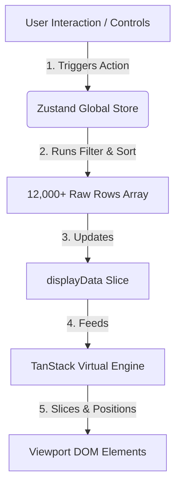

# High-Performance Virtualized Data Table

A responsive, high-performance data table built with **React**, **TypeScript**, and **Vite** capable of displaying and managing large datasets (12,000+ rows) efficiently using **TanStack Virtual** and **Zustand**. 

This project simulates a real-world enterprise dashboard containing interactive sorting, filtering, accessibility (a11y) support, and containerization.

---

## 🛠️ Tech Stack

* **Core**: React 19, TypeScript 6, Vite 8
* **Virtualization**: `@tanstack/react-virtual` (v3)
* **State Management**: `Zustand` (v5)
* **Mock Data**: `@faker-js/faker` (v10)
* **Styling**: Vanilla CSS (Modern Glassmorphic Dark Theme)
* **Testing**: Jest, React Testing Library, ts-jest, jest-environment-jsdom
* **Deployment & Containerization**: Docker, Docker Compose, Nginx (Alpine)

---

## 🚀 Key Features

1. **DOM Virtualization (Windowing)**: Renders only the visible subset of rows plus a small pre-fetch buffer (~20-30 rows) instead of creating 12,000+ DOM nodes, guaranteeing a consistent 60 FPS scrolling experience.
2. **Atomic Client-Side State**: Centralized **Zustand** store managing data sorting, filtering, initialization, and loading flags. It avoids context-based prop-drilling, isolating render cycles.
3. **Smart Debounced Inputs**: The Name text filter is debounced at 350ms, deferring heavy array searches and state dispatches until typing pauses to keep the input interface smooth.
4. **Ascending ➔ Descending ➔ Unsorted Sort Cycle**: Clicking column headers cycles the sort configuration (handles alphabetical text, date formats, and numerical values correctly), complete with visual arrow indicators.
5. **Accessibility (a11y) Compliance**: 
   * Fully navigable using only a keyboard (Tab to focus column headers, Enter/Space to sort).
   * Screen-reader semantic roles defined (`role="table"`, `role="rowgroup"`, `role="row"`, `role="columnheader"`, `role="cell"`).
   * Dynamic ARIA attributes indicating state change (`aria-sort`, `aria-label`).
6. **Premium Responsive Theme**: Out-of-the-box CSS dark theme featuring glassmorphic overlays, custom scrollbars, and fluid media queries (hides secondary columns and enables horizontal scroll on mobile).
7. **Robust Error Boundary**: Employs React Error Boundaries to catch layout or rendering exceptions, preventing complete application crashes.

---

## 📂 Project Structure

```text
virtualized-data-table/
├── .github/                   # GitHub action settings (if any)
├── public/
│   ├── favicon.svg            # Tab icon
│   └── icons.svg              # Vector assets
├── src/
│   ├── assets/                # Logos and mock images
│   ├── components/
│   │   ├── DataTable/         # Core virtual table & Row components
│   │   │   └── index.tsx
│   │   ├── TableControls/     # Filter and resetting panels
│   │   │   └── index.tsx
│   │   └── ErrorBoundary/     # React error boundary component
│   │       └── index.tsx
│   ├── store/
│   │   └── dataTableStore.ts  # Zustand global store configuration
│   ├── utils/
│   │   └── generateMockData.ts # Seeded Faker.js data generator
│   ├── App.tsx                # Application shell & initialization
│   ├── index.css              # Custom dark-theme glassmorphism styles
│   └── main.tsx               # DOM entrypoint
├── tests/
│   ├── DataTable.test.tsx     # Component integration tests
│   └── dataTableStore.test.ts # Zustand state logic unit tests
├── .dockerignore
├── .env.example
├── .gitignore
├── docker-compose.yml
├── Dockerfile
├── jest.config.ts
├── jest.setup.ts
├── nginx.conf                 # SPA static distribution routing
├── package.json
└── tsconfig.jest.json         # Dedicated Jest compiler options
```

---

## ⚙️ Workflow Architecture



1. **Data Hydration**: On mount, `App.tsx` triggers seeded generation of 12,000 rows and commits them to the Zustand store.
2. **Filtering/Sorting**: Text input changes and column clicks mutate store filters. The store computes the subset inside a `setTimeout` to allow the React UI to display a processing overlay.
3. **Viewport Calculations**: TanStack Virtual observes scroll offsets of the scroll container, fetching corresponding indexes from the stored `displayData` and positioning them using absolute CSS `translateY` transforms.

---

## 💻 Local Development

### Prerequisites
* [Node.js](https://nodejs.org/) (v20+ recommended)
* NPM

### Setup & Run
1. Install project dependencies:
   ```bash
   npm install
   ```
2. Launch local Vite development server:
   ```bash
   npm run dev
   ```
   *Open [http://localhost:5173](http://localhost:5173) in your browser.*

3. Build production bundles:
   ```bash
   npm run build
   ```

---

## 🧪 Testing Suite

Tests are configured using Jest and ts-jest. Run the suite to verify logic stability:
```bash
npm run test
```

*Includes unit tests for search/filter operations and sort-cycling, as well as integration tests for keyboard actions and accessibility attributes.*

---

## 🐳 Docker Deployment

The application is fully containerized. A multi-stage build creates the bundle and serves it using Nginx Alpine.

1. Build and run containers in the background:
   ```bash
   docker-compose up --build -d
   ```
2. Access the application on [http://localhost:3000](http://localhost:3000).

3. Tear down containers:
   ```bash
   docker-compose down
   ```
